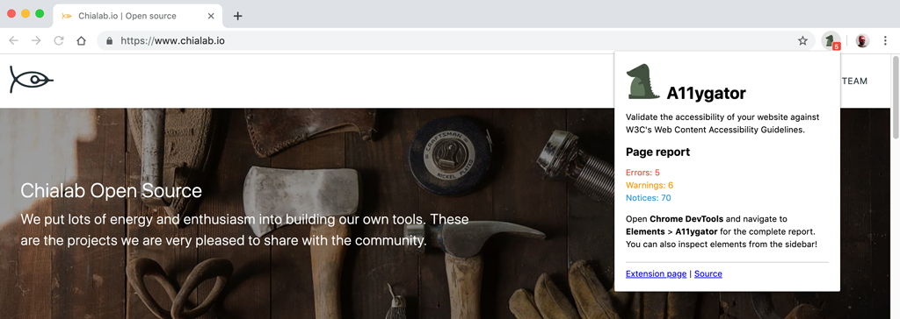
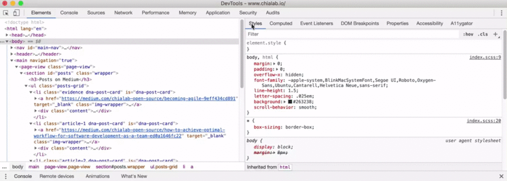

    

  <strong>A11ygator</strong> • Validate the accessibility of your website against W3C's Web Content Accessibility Guidelines.

    <a href="https://chrome.google.com/webstore/detail/a11ygator/imfmlpemomjmfncnmkjdeeinbkichaio">Chrome extension</a> |
    <a href="https://github.com/chialab/a11ygator-extension">Source</a> |
    <a href="https://www.chialab.io/p/a11ygator-app">WebApp</a> |
    <a href="https://www.w3.org/WAI/standards-guidelines/wcag/">WCAG</a> |
    <a href="https://www.chialab.it">Authors</a>

---

A11ygator is a free tool for web developers to check compliance with the WCAG rules. Once the extension has started, it will observe for content changes in the HTML document and it will generate a report with errors, warnings and notices.

Thanks to the integration with DevTools, it is easy to inspect elements and quickly update CSS rules or HTML attributes in order to match the required WCAG standard.

Not so comfortable with dev tools? **Check out the [Web version](http://a11ygator.chialab.io)**.

### Quick validation

Get a quick report of the page from the extension popup.

### DevTools

For a complete report of the page, use the DevTools section (`Elements > A11ygator`). You can inspect and live debug accessibility issues.

### Change the standard to validate

You can change the WCAG standard for validation (default is WCAG2AA). Right-click the extension icon and select `Options`.

## Development

* [How to load an unpacked extension in Chrome](https://developer.chrome.com/extensions/getstarted)
* [How to load an unpacked extension in Firefox](https://developer.mozilla.org/en-US/docs/Mozilla/Add-ons/WebExtensions/Temporary_Installation_in_Firefox)

### Publish

* Run `make pack` in the root of the project
* [How to publish an extension to Chrome Web Store](https://developers.chrome.com/webstore/publish)
* [How to publish an add-on to Firefox Add-on Developer Hub](https://developer.mozilla.org/en-US/docs/Mozilla/Add-ons/Distribution/Submitting_an_add-on)

## More

Also check out [A11ygator WebApp Repository](https://github.com/chialab/a11ygator-app).

## Credits

A11ygator runs on the top of [HTML Code Sniffer](https://github.com/squizlabs/HTML_CodeSniffer) powered by Squiz Labs.

## License

A11ygator is released under the [MIT](./LICENSE) license.
